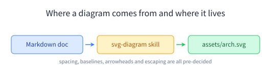

# awesome-skills

[](LICENSE)

Agent Skills for Claude Code and any other agent that reads `SKILL.md`.

A skill is a Markdown file with YAML frontmatter. The agent loads the `description` up front, and pulls in the body only when the work matches, so you can write a long, opinionated document without paying for it on every turn.

```yaml
---
name: svg-diagram
description: SVG diagramming conventions ... Use when creating flowcharts, architecture diagrams, and similar SVG figures.
---
```

The `description` is the trigger. Write it as "what it covers + when to use it", or the agent will never reach for the skill.

## What's here

| Skill | What it gives you |
|-------|-------------------|
| [`svg-diagram`](SKILL.md) | A house style for hand-written SVG diagrams: layout math, connector geometry, colors, CJK-safe fonts, and a verification checklist |

## Install

Claude Code discovers skills in `~/.claude/skills/<skill-name>/SKILL.md` (all projects) or `.claude/skills/<skill-name>/SKILL.md` (one project).

```bash
git clone https://github.com/bybit-exchange/awesome-skills.git ~/.claude/skills/svg-diagram
```

Or, if you'd rather not clone into your config directory:

```bash
mkdir -p ~/.claude/skills/svg-diagram
curl -fsSL https://raw.githubusercontent.com/bybit-exchange/awesome-skills/main/SKILL.md \
  -o ~/.claude/skills/svg-diagram/SKILL.md
```

Start a new session and ask for a diagram. Claude should announce that it's using `svg-diagram`.

## svg-diagram



Ask a model for a diagram and you tend to get one of two things: ASCII art, or an SVG where the labels sit on top of the arrows and the bottom row is clipped by the viewBox. Neither survives a code review, and fixing them by hand is a pixel-by-pixel conversation.

The skill settles those numbers up front:

| Area | What's pinned down |
|------|--------------------|
| **Layout** | viewBox margins (20–25px), block spacing (≥25px, never past 30px), how to center on the *content* center rather than the viewBox center |
| **Boxes** | Height from font size (`font-size × 3` for one line), and the `× 0.35` baseline offset that actually centers text vertically |
| **Connectors** | Straight lines only when co-axial, C/Q curves for turns, no right-angle elbows; start/end formulas that leave symmetric 5px clearance |
| **Arrowheads** | Notched markers with `markerUnits="userSpaceOnUse"` and `refX="2"`, plus larger variants for thick strokes |
| **Text** | Per-font-size width tables for Latin and CJK, so you can check for overflow before you place a label |
| **Fonts** | A mandatory CJK-capable stack (`PingFang SC` → `Microsoft YaHei` → `Noto Sans CJK SC`), so diagrams don't render as tofu boxes on a Linux server |
| **Colors** | Five semantic fill/stroke/text triples, for input, processing, output, analysis and warning |
| **Escaping** | `&`, `<`, `>` in labels, including a helper for SVG generated from CSV or API data |

It closes with a 20-item verification checklist and a troubleshooting table keyed by symptom ("arrowhead invisible", "content clipped at the bottom", "too much blank space"). The checklist is the part that matters: the skill asks the agent to walk it before showing you anything.

Two practical notes from the skill itself:

- For a one-shot diagram, invoke it from a subagent. The skill plus the resulting SVG XML is a lot of context to carry in your main session. For iterative tweaking, load it directly.
- Diagrams belong in an `assets/` directory next to the document and get referenced with a relative path, never inlined into the Markdown.

## Contributing

Today the repo holds a single skill, with `SKILL.md` at the root so it can be cloned straight into a skills directory. Adding a second one means moving each into its own `<skill-name>/SKILL.md`, which is the layout to aim for.

Keep the frontmatter to `name` and `description`. The description should say when to use the skill; that sentence is what the agent matches on.

Before you open a PR, use the skill for a real task in a fresh session. If the agent didn't load it on its own, the description needs work; if the output still needed manual correction, the body is missing a rule.

## License

[MIT](LICENSE)
