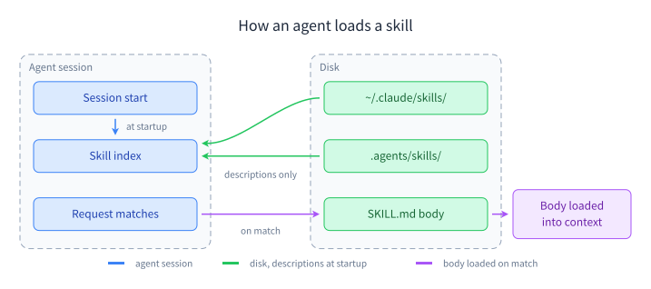
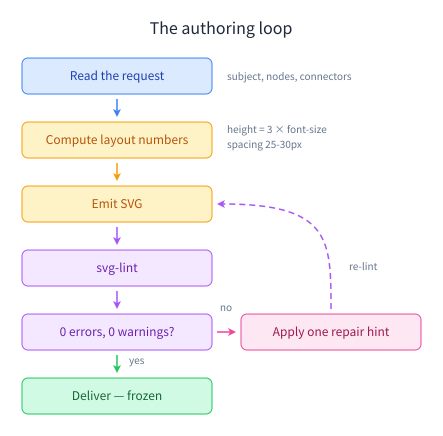
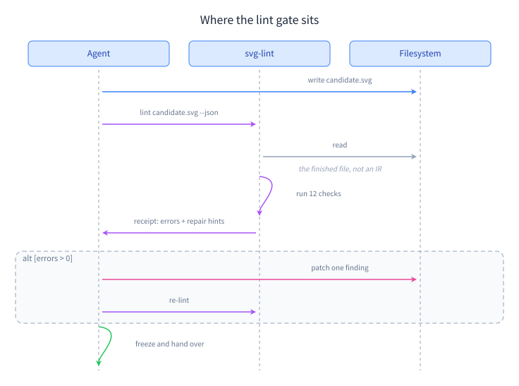
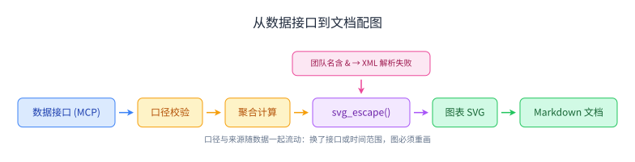
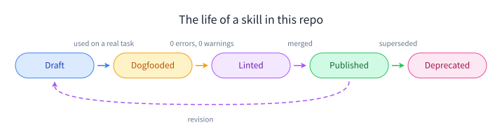
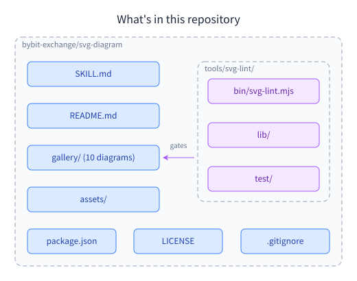
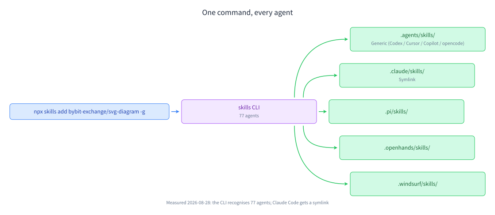
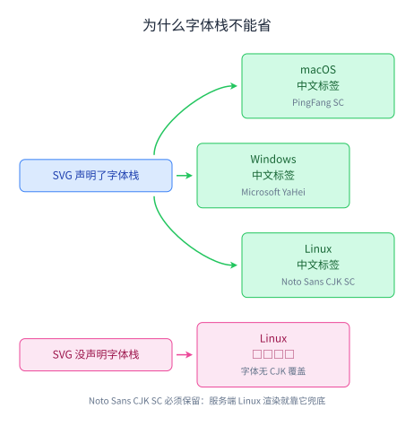
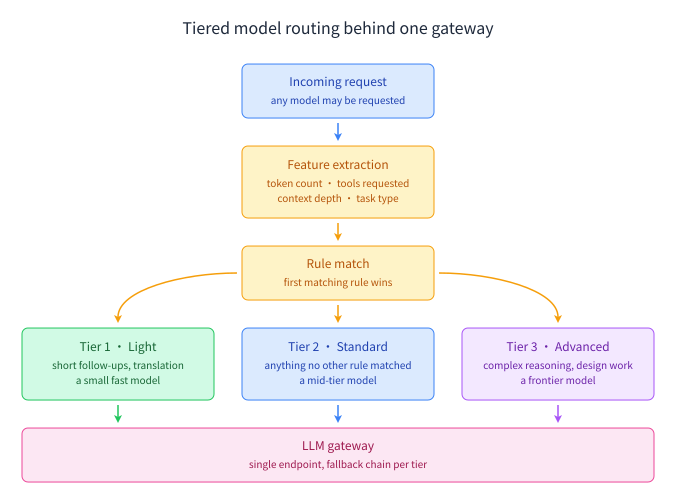
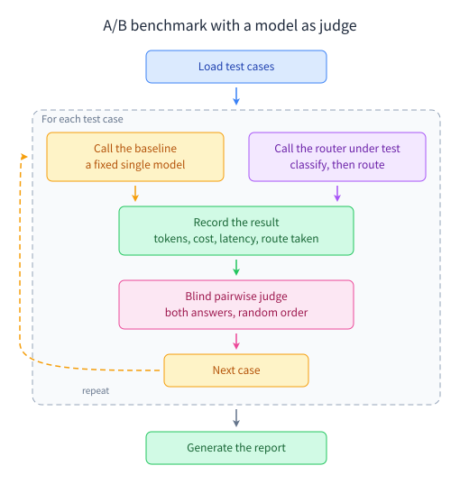

# svg-diagram

A house style for hand-written SVG diagrams your agent can follow — the layout arithmetic, the colour system, and a zero-dependency linter that proves it did.

[](LICENSE)
[](https://github.com/vercel-labs/skills)
[](#the-lint-gate)


## Install

```bash
npx skills add bybit-exchange/svg-diagram -g
```

That's it — the CLI detects which agents you have installed and writes each one's path. Drop `-g` to install into the current project instead.

`SKILL.md` sits at the repository root, so the install copies the root: 79 files, 979K. That carries `svg-lint` along with the skill text, and because the linter has no dependencies it runs from wherever it landed — measured, with no `node_modules` present, the CLI and its 933-test suite both run from the installed directory:

```bash
node ~/.claude/skills/svg-diagram/tools/svg-lint/bin/svg-lint.mjs diagram.svg
```

One thing to know if you install from a local path rather than from GitHub: the CLI copies the directory as it finds it and consults no `.gitignore`, so anything untracked sitting beside `SKILL.md` is copied as well.

Every path in this table came out of a real `npx skills add ... --all --copy` run: 77 agents, 56 directories written. `--copy` is why each row is a real directory; the default writes one copy into a canonical directory and points each agent's path at it, so the paths are the same either way. Each destination is named from the skill's frontmatter `name`, not from where the skill sits in this repository, so they do not change when the source moves.

| Surface | Path | Measured |
|---|---|---|
| Any detected agent | `npx skills add bybit-exchange/svg-diagram -g` | ✅ 77 agents, 56 directories |
| Claude Code | `~/.claude/skills/svg-diagram/` or `.claude/skills/svg-diagram/` | ✅ its own directory |
| Codex CLI, Cursor, Gemini CLI, GitHub Copilot, opencode, Antigravity | `~/.agents/skills/svg-diagram/` or `.agents/skills/svg-diagram/` | ✅ none of them get a private directory — they share this one |
| Pi | `~/.pi/skills/svg-diagram/` | ✅ its own directory |
| OpenHands, Windsurf, Continue, Roo, Kilo Code, Goose, Qwen, Junie, Kiro, Trae, +40 more | `~/.<agent>/skills/svg-diagram/` | ✅ one directory per agent |
| Anything else that reads `SKILL.md` | Copy `SKILL.md` into its skills directory | — |

Claude.ai is the one surface no command reaches, so it is the one row that is **not measured**: upload the folder as a zip under Settings → Capabilities → Skills (skill text only — `svg-lint` needs local Node).

Doing it by hand works too. Clone, then copy the one file the agent reads — or the whole tree if you want the gallery and the linter with it:

```bash
git clone https://github.com/bybit-exchange/svg-diagram.git
mkdir -p ~/.claude/skills/svg-diagram
cp svg-diagram/SKILL.md ~/.claude/skills/svg-diagram/
```

Or take that file without cloning at all. With it at the root, the URL is the repository plus the filename:

```bash
mkdir -p ~/.claude/skills/svg-diagram
curl -fsSL https://raw.githubusercontent.com/bybit-exchange/svg-diagram/main/SKILL.md \
  -o ~/.claude/skills/svg-diagram/SKILL.md
```

Either way the skill works on its own; `svg-lint` is what you give up, so use `npx skills add` or copy the tree if you want the gate.

Start a new session and ask for a diagram; the agent should announce that it's using `svg-diagram`.

## Gallery

Ten diagrams, all drawn under this skill and all lint clean. Each is here for the rule it demonstrates.

### How an agent loads a skill

Two side-by-side dashed containers with connectors crossing the channel between them, and a colour change that marks the point where a request matches. The two-tier load is what an agent actually does.



### The authoring loop

A cross-layer loop-back line, painted after the boxes so they don't cover it.



### Where the lint gate sits

A self-call drawn as a curve whose second control point shares the end point's x, so the arrowhead lands pointing straight down.



### From a data API to a document figure (从数据接口到文档配图)

CJK labels sized from the CJK column of the width table — one full font size per character, 12px rather than 7.



### The life of a skill in this repo

One semantic triple per state along the row; the four forward arrows each carry the colour of the state they leave. The dashed revision loop is stroked in the AI/analysis purple.



### What's in this repository

A border is drawn only where the contents are drawn — `gallery/` and `assets/` are directories as much as `tools/` is, but their members are not in the figure, so they stay plain boxes. The one that does get a border shares its dasharray and corner radius with the outer root, which uses slightly more padding. The single connector is straight because both of its ends sit on the target box's vertical centre.



### One command, every agent (一行命令，装到所有 agent)

A one-to-many fan-out whose branch curves each keep the second control point level with the end point, so every arrowhead lands pointing right.



### Why the font stack cannot be dropped (为什么字体栈不能省)

A contrast pair built from two semantic triples: the working paths in green, the branch that fails in pink.



### Tiered model routing behind one gateway

A symmetric fan-out and convergence, one semantic triple per tier. The two outer legs leave the rule box's left and right edges at its vertical centre; only the middle leg uses the bottom edge.



### A/B benchmark with a model as judge

A dashed group box around exactly the steps that repeat, its height counting the 25px title band, and a dashed return edge painted last so it stays legible where it crosses the wall.



## What the skill pins down

| Area | What's pinned down |
|---|---|
| Layout | viewBox margins of 20–25px, the title centred on the content centre rather than the viewBox, and off-centre content shifted with a single `<g transform="translate(dx,0)">` |
| Boxes | Height derived from the font — one line is `font-size × 3`, each extra line adds `font-size × 1.5` — and boxes sharing a row whose sizes differ by no more than 60px |
| Connectors | A straight `L` only when the two ends are co-axial, a `C` or `Q` curve for anything that turns, and no right-angle elbows |
| Arrowheads | A notched marker with `markerUnits="userSpaceOnUse"`, sized to the line's stroke width, starting 5px clear of the source and ending 11px short of the target |
| Text | Baseline at `box y + height/2 + font-size × 0.35` to centre inside a box, `font-size × 0.75` to position from the top, and at least 10px of clearance from a straight connector — 15px from a curve, with the label above a downward-bending curve and below an upward-bending one |
| Fonts | 16px titles, 12px box text, 10px annotations, over a stack that keeps `Noto Sans CJK SC` so Linux rendering does not fall back to tofu |
| Colours | Five semantic fill/stroke/text triples applied through presentation attributes — no CSS classes, no media queries |
| Escaping | `&`, `<`, `>`, `"` and `'` escaped in text and attributes, and anything coming from a database or an API escaped before it is concatenated into the file |

## Why

- **Checked where it counts.** The linter reads the finished SVG, not an intermediate format. There is nothing between the receipt and the file you ship.
- **Zero dependencies.** `svg-lint` is plain Node with no packages. It runs in a fresh clone, with no install step and no lockfile.
- **Placed, not auto-laid-out.** The skill hands the agent the arithmetic — box height, baseline offset, arrow clearance, block spacing — so every element lands somewhere chosen rather than somewhere a layout engine picked.
- **Findings name the fix.** A failure reports the value it found and the value it should hold, and names the attribute whenever one attribute is at fault: `viewBox: 11 → 20–25`, not "the margin looks wrong". Where the measurement spans two elements — a gap between boxes, a label resting on a line — it gives the numbers and what to do instead of pointing at an attribute that is not the culprit.
- **CJK-safe by default.** A mandatory font stack, plus separate character-width tables for Latin and CJK, so labels are checked for overflow before they are placed.
- **Readable on any background.** Every diagram paints its own white canvas rect rather than switching themes — see [background rect and dark pages](#background-rect-and-dark-pages).
- **Plain SVG out.** No runtime, no viewer, no JavaScript. It renders in a README, a docs site, a PDF and a terminal preview.
- **Reviewable as text.** Every coordinate is a literal in the file, annotated with comments that explain why a coordinate holds its value, so a change to a diagram reads as a diff instead of a re-render. Most are whole numbers; the ones that are not fall out of the arithmetic rather than being placed by eye — the `font-size × 0.35` in the baseline formula puts a 12px label's baseline on a `.2`, and the centre of a 305px-wide box falls on a half pixel.

## How it works

| Step | What happens |
|---|---|
| **Load** | The agent matches the request against the skill's `description`. Until then only that one line is resident — the 586-line file costs nothing. |
| **Compute** | Layout numbers come from formulas, not guesses: box height = `font-size × 3`, baseline = box centre + `font-size × 0.35`, arrow start/end = edge ± 5 / ∓ 11, block spacing 25–30px. |
| **Emit** | The agent writes one SVG — hand-placed coordinates with comments explaining the arithmetic behind them, semantic colours as presentation attributes, and a white canvas rect as the first painted element. |
| **Lint** | `svg-lint` runs its 12 checks against that file and returns a receipt naming what to change, in the shape described under **Findings name the fix** above. |
| **Freeze** | A file that passes is frozen; a later edit means a later lint. The bar itself is under [the lint gate](#the-lint-gate). |

Try the gate on a deliberately broken file:

```bash
printf '%s' '<svg xmlns="http://www.w3.org/2000/svg" viewBox="0 0 200 60" width="200"><text x="50" y="20" font-size="12">Load & Save</text></svg>' > /tmp/broken.svg
node tools/svg-lint/bin/svg-lint.mjs /tmp/broken.svg
```

It reports the unescaped `&`, the missing font stack, the missing white canvas rect, an off-palette fill, four viewBox margins outside the 20–25px range, and asymmetric margins on both axes. Three errors, seven warnings, non-zero exit.

## The lint gate

`svg-lint` reads the finished SVG and reports what the house style forbids. It is a maintainer tool, run by hand. Nothing invokes it for you, so run it before you hand a diagram over. Both paths are root-relative, so run these from the repository root:

```bash
node tools/svg-lint/bin/svg-lint.mjs diagram.svg
node tools/svg-lint/bin/svg-lint.mjs diagram.svg --json
```

A 200×60 file with an unescaped `&`, a 20px-tall box and a lopsided viewBox comes back like this. The
exact file is worth having, because a transcript with no recipe cannot be checked:

```bash
printf '%s' '<svg xmlns="http://www.w3.org/2000/svg" viewBox="0 0 200 60" width="200"><rect x="10" y="10" width="80" height="20" fill="#dbeafe" stroke="#3b82f6"/><text x="50" y="20" font-size="12">Load & Save</text></svg>' > /tmp/lint-demo.svg
node tools/svg-lint/bin/svg-lint.mjs /tmp/lint-demo.svg
```

One line, no trailing newline, so every finding below is reported at line 1 and the column is a
1-based offset into it: 74 is the `<rect`, 150 the `<text`, 190 the bare `&`.

```
/tmp/lint-demo.svg
  1:1  error    No <style> rule declares font-family for text  [font-stack/missing-font-stack]
           repair: font-family: absent → 'PingFang SC', 'Microsoft YaHei', 'Noto Sans CJK SC', system-ui, sans-serif · SKILL.md marks this non-negotiable
  1:1  error    The left viewBox margin is 10px, below the 20px minimum  [viewbox-clipping/margin-too-small]
           repair: viewBox: 10 → 20–25 · grow the viewBox on that side
  1:1  warning  The right viewBox margin is 73px, above the 25px recommendation  [viewbox-clipping/margin-too-large]
           repair: viewBox: 73 → 20–25 · shrink the viewBox so it hugs the content
  1:1  error    The top viewBox margin is 10px, below the 20px minimum  [viewbox-clipping/margin-too-small]
           repair: viewBox: 10 → 20–25 · grow the viewBox on that side
  1:1  warning  The bottom viewBox margin is 30px, above the 25px recommendation  [viewbox-clipping/margin-too-large]
           repair: viewBox: 30 → 20–25 · shrink the viewBox so it hugs the content
  1:1  warning  Top margin 10px and bottom margin 30px differ by more than 5px  [viewbox-clipping/vertical-margin-asymmetric]
           repair: 10 / 30 → within 5px · adjust the viewBox height, measuring the top margin from the title
  1:1  warning  Left margin 10px and right margin 73px differ by more than 5px  [viewbox-clipping/horizontal-margin-asymmetric]
           repair: 10 / 73 → within 5px · wrap the content in <g transform="translate(31.5, 0)">
  1:74  error    Box is 20px tall but 1 line(s) at 12px need 36px  [box-height/box-too-short]
           repair: height: 20 → 36 · font-size × 3
  1:150  warning  Baseline is at y=20; optical centring wants y=24.2  [baseline-offset/baseline-off-center]
           repair: y: 20 → 24.2 · box y + box height/2 + font-size × 0.35
  1:150  error    Label inside a box resolves to text-anchor="start"  [baseline-offset/label-not-centered]
           repair: text-anchor: absent → middle · box labels are centred in house style
  1:150  warning  fill "#000000" is not in the house palette  [palette-conformance/off-palette-color]
           repair: fill: #000000 → a palette colour · pick one of the five semantic triples, the base text colours, or an arrow colour
  1:150  warning  Label colour #000000 does not match the "input" triple  [palette-conformance/semantic-text-color-mismatch]
           repair: fill: #000000 → #1e40af · or use a base text colour
  1:150  error    Label needs 77px but its box is only 80px wide  [text-overflow/text-overflows-box]
           repair: 77 → ≤76 · widen the box, shorten the label, or move the text outside and centre it below
  1:190  error    Raw "&" found; escape it as &amp;  [xml-escaping/unescaped-ampersand]
           repair: & → &amp; · an unescaped & makes the whole SVG fail to render

1 file(s), 7 error(s), 7 warning(s)
```

The process exits 1, because of the errors. That block is the whole of stdout, so it can be diffed
against your own run line for line.

Every finding carries the id of the check that raised it. Each entry below names the main judgment; some checks have additional codes not shown here:

- `xml-escaping` — a raw `&` or `<` in text or in an attribute value, an entity XML does not predefine, a duplicated attribute whose last value silently wins, and a comment whose content contains `--` or ends in `-`, which no XML parser accepts; all four are errors, because the file either fails to parse or loses a value. A bare `>` is legal XML and is reported as a warning, since house style escapes it anyway
- `viewbox-clipping` — an absent `viewBox` or `width`, content falling outside the viewBox, margins outside 20–25px, and top/bottom or left/right margins that differ by more than 5px
- `font-stack` — a missing `font-family`, a stack that has dropped one of the three CJK families, and one that lists them in the wrong order
- `box-height` — boxes too short for the lines they hold, and line spacing that is not `font-size × 1.5`
- `baseline-offset` — labels not optically centred in their box, a multi-line block whose lines are centred on the wrong y, box labels that are not `text-anchor="middle"`, and a middle-anchored label whose `x` is not the box centre
- `block-spacing` — gaps between adjacent boxes below 25px or above 30px, boxes sharing a row whose sizes differ by more than 60px, and a title centred on something other than the content
- `arrow-marker` — a missing `markerUnits` or `orient`, a marker whose size is off the table for its stroke width or is not square, a `refX` / `refY` that does not match the marker's size, a `marker-start` or `marker-end` referencing a marker that is not defined, and the 5px of clearance required at both ends — 11px being where an 8px arrowhead's line has to stop for its tip to land 5px short, which is 14px for a 12px head and 17px for a 16px one
- `text-overflow` — labels wider than their box, or 10px or less from the neighbouring box on either side; 10px exactly is a finding, since the rule asks for more than 10
- `overlap` — text sitting on a connector or across a box it does not belong to, a connector cutting through a box, and detours that pass closer than 20px to the obstacle. Also a label whose glyph box lands on the *outline* of a dashed grouping box: each of the four edges is judged as a band one stroke wide, so the group's own title and its member labels are fine wherever they sit inside — it is only text straddling a wall that reads as a collision
- `light-bg-fallback` — dark text with no light fill painted behind it
- `palette-conformance` — colours outside the house palette, a fill and stroke that come from two different semantic triples, a label whose colour does not match its box's triple, and dashed containers styled inconsistently
- `connector-geometry` — right-angle elbows, diagonal `L` runs where a curve belongs, visible segments under 6px, and two ways a curve's last control point misdirects the arrowhead: sitting past the tip, which turns the tangent back along the connector, or sitting off the axis of a run that is axis-aligned, which tilts an arrowhead that should be level or plumb

A thirteenth id, `document-model`, appears in the same position but names no check. It is how the model
layer reports what it could not read — an unsupported transform, an arc command it does not model — so
that the geometry judgments are not silently drawing conclusions from coordinates they got wrong.

> `0 errors, 0 warnings` is the only pass; a warning is a failure.

The linter's own reference — exit codes, the `--json` shape, and what each check does and does not
catch — is in [tools/svg-lint/README.md](tools/svg-lint/README.md).

## Background rect and dark pages

The first painted element of every diagram is `<rect ... fill="#ffffff"/>`, so on GitHub's dark theme the diagram reads as a light card rather than dark text on a dark background.

This is not theme switching. The diagram carries one colour set, and the rect exists only so that set stays readable wherever the file is embedded.

> The colour palette and layout rules live in [SKILL.md](SKILL.md).

## Troubleshooting

| Symptom | What to check |
|---|---|
| Elements overlap | Text-to-line clearance ≥10px; does a detour path cross a boundary? |
| Arrowhead invisible | Block spacing below 25px — increase it |
| Label off-center | Confirm `text-anchor="middle"` and x = center of the gap |
| Arrow points the wrong way | Check the direction of the final path segment (x/y increasing or decreasing) |
| XML parse error | Check whether `&` `<` `>` in text are escaped |
| Content clipped at the bottom | viewBox height too small; it must equal the bottom edge of the lowest element + 25px |
| Dashed group box off-center after adding a title | Vertical centering must use the combined "title + content" height — see "Dashed grouping boxes" in [SKILL.md](SKILL.md) |
| Too much blank space overall | Check whether box spacing >30px or viewBox margin >25px |
| Diagram unreadable on a dark page | Is there a `<rect fill="#ffffff" ...>` as the first painted element? |
| `svg-lint` warns about dark readability | Add a `<rect fill="#ffffff" x="0" y="0" width="..." height="..."/>` as the first drawn element after `<defs>` |
| The light-background check fires | Same as above — no light background rect while dark text is present |

> Anything in this table that `svg-lint` can catch, it already does — run it before reading this table.

## Rules reference

> SKILL.md is the single source of truth — [read it](SKILL.md).

| Section | What it covers |
|---|---|
| Output location and referencing | Where the file lands — an `assets/` directory beside the document — and how markdown points at it. |
| Core principles | Get the first pass right, let nothing overlap, and keep the two halves of the figure similar in weight. |
| Layout rules | Centring, viewBox margins, box dimensions and dashed containers, each with the arithmetic behind it. |
| Connector rules | When a line may be straight, how to control the direction an arrowhead faces, and the paint order that keeps a loop-back visible. |
| Estimating text width (overflow protection) | The per-font-size character width table, Latin and CJK, and the formula for each `text-anchor`. |
| Placing labels on curves | Keep 15px between the label and the nearest point on the curve, and which side of the bend to use. |
| Coordinate management | Record box edges in comments, and update the six dependents whenever an element moves. |
| Style rules | The required font stack, the three font sizes, and the five semantic colour triples. |
| Arrowhead definitions | The notched marker, its six colour variants, and how marker size and `refX` scale with stroke width. |
| XML special characters (high risk, always check) | The five characters to escape, plus escaping text that arrives from a database or an API. |
| Troubleshooting | SKILL.md covers 8 of the 11 symptoms in the table above; the three rows about dark-page readability have no counterpart there. |
| Verification checklist | Twenty items to walk before showing the diagram to anyone. |
| Editing workflow | Collect every requested change first, apply them in one pass, then print the change list. |

## What a skill is

A skill is a Markdown file with YAML frontmatter. The agent loads the `description` up front, and pulls in the body only when the work matches, so you can write a long, opinionated document without paying for it on every turn.

```yaml
---
name: svg-diagram
description: SVG diagramming conventions ... Use when creating flowcharts, architecture diagrams, and similar SVG figures.
---
```

The `description` is the trigger. Write it as "what it covers + when to use it", or the agent will never reach for the skill.

## Contributing

This repository holds one skill, and the `SKILL.md` at the root is it.

Frontmatter takes `name` and `description`; `license` and a `metadata` map (version, author, requirements) are welcome too. `name` is what every install path keys off — the `skills` CLI names the destination directory from it, not from anything in this repository's layout. The `description` is what the agent matches on, so write it as "what it covers + when to use it".

Before you open a PR, use the skill for a real task in a fresh session. If the agent didn't load it on its own, the description needs work; if the output still needed manual correction, the body is missing a rule — or the linter is missing a check.

Diagrams committed to this repo must pass `svg-lint` with 0 errors and 0 warnings:

```bash
npm run lint:svg:all
```

That covers the 11 SVGs the repo ships. Everything under `tools/svg-lint/test/fixtures/` is excluded — for the 14 under `fail/`, failing is their job, and the 2 under `pass/` are asserted by the test suite instead.

## License

[MIT](LICENSE)
